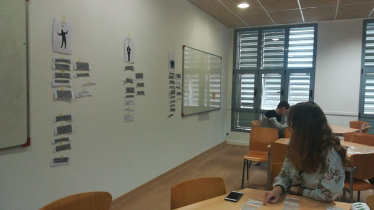

<link rel="stylesheet" type="text/css" href= "../estilo.css" media="screen" />

# Cada Oveja con su Pareja
Es un juego de asociación con 39 cartas con las responsabilidades a los tres roles de Scrum.

La manipulación de las cartas consigue involucrar a los alumnos en el juego y ofrece un nivel adicional de complejidad a la revisión de una lista de responsabilidades.

Version en [inglés](https://www.tastycupcakes.org/2014/01/scrum-roles-and-responsibilities-game/)

## PUNTOS DE APRENDIZAJE
Enterder el papel de cada uno de los componentes del framework Scrum.

## TEMPORIZACIÓN
*   En una sola fase, entre todos los alumnos:
    *   Al menos se necesitan 10 minutos para la asociación de todas las reponsabilidades y 5 minutos para el debriefing y para resolver dudas.
*   Si se hace en dos tandas:
    *   10 Minutos para la fase individual
    *   10 Para la puesta en común que sirve de debriefing

## MATERIALES
Se tiene dos tamaños diferentes:
*   Fichas de la actividad para cada alumno, [fichas individuales](fichas.pdf).
*   Fichas para usar sobre la pizarra, [fichas](grande.pdf).
*   Sobres para poner las fichas.
*   Las fichas con fondo blanco indican la no obligatoriedad de la responsabilidad.

## INSTRUCCIONES DE EJECUCIÓN

### En una fase
Se reparten las [fichas](grande.pdf) grandes entre los alumnos y entre todos a la vez o por turno las asocian al rol correspondiente.

### En dos fases

Se reparten los sobres con las [fichas](fichas.pdf) entre los alumnos dejandoles 10 minutos para que las manipulen y las asocien a los distintos roles

Posteriormente, los alumnos se turnan para compartir la asociación elegida, explicándola y unificándola con el resto de sus compañeros, sacando al alumno de su zona de confort colocando físicamente la ficha sobre la pizarra.

## Notas sobre la actividad

En lugar de tarjetas o cartas, simplemente se pueden utilizar papelitos que se entregan a los alumnos dentro de un sobre totalmente desordenados.

El hecho de tener que manipular las fichas es básico para el exito de esta actividad.

La manipulación ayuda a entender los conceptos.

## Imagenes de la experiencia

