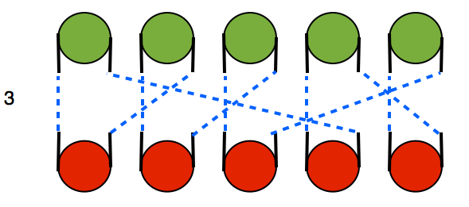

# Espagueti humano

Un juego para ilustrar la belleza de la autoorganización, y el dolor de la gestión «experta»

## PUNTOS DE APRENDIZAJE

Importancia de los equipos autogestionados.
Implicación y compromiso de los miembros del equipo de trabajo
TEMPORIZACIÓN

 10-20 minutos 

## MATERIALES

De forma opcional puede ser necesario unos trozos de cuerda o gomas elásticas para aumentar la longitud de los brazos.

## INSTRUCCIONES

Dependiendo del número de participantes se puede hacer en modelo de competición (cada equipo se organiza de forma diferente) o bien el mismo grupo realiza el ejerccio de los tres modos.

Formar un nudo spaguetti entrecruzando los brazos de los participantes. La configuración para distinto número de personas se muestra a continuación

Caso de 10 alumnos 

Caso de 12 Alumnos 

Caso de 14 alumnos 

### MODO 1:

Una vez que el equipo haya establecido el formato de espagueti,
Se designa un analista y un gerente (o solicite voluntarios).
El resto de los participantes actúan como observadores, y debe enfatizar la importancia del rol del observador para dar retroalimentación después del ejercicio
Se le pide al analista que escriba una especificación: un conjunto de pasos que los miembros del equipo deben seguir para resolver el problema.
Los miembros del equipo no se mueven sólo mantienen posición.
Puede ofrecerle al analista una herramienta analítica de vanguardia (una silla sobre la cual apoyarse)
NOTA: Después de un tiempo quedará claro que esto es difícil de hacer. Tal vez los primeros 2-3 pasos estarán escritos. Esperaremos unos minutos, expresando impaciencia. Despedir al analista Contratar a un gerente para dirigir el equipo y pasar al MODO 2

### MODO 2:

Se le pide al gerente que de las instrucciones a cada miembro del equipo, utilizando el documento de requisitos que escribió el analista (si se las arreglaron para hacerlo) o bien si no hay ningún documento, use directivas de microgestión bien conocidas para decirle a la gente qué hacer. (es decir «muevete por debajo de este brazo» «girate sobre ti mismo»,…
Los miembros del equipo se moverán si se les dice, y solo si se les dice. Los miembros del equipo que no tengan instrucciones de moverse deben esperar su turno. Son pasivos, no tomarán iniciativas.
Por lo general, esto no dará lugar a una solución en un tiempo razonable. Espere unos minutos. Despedir al gerente y pasar al MODO 3.

### MODO 3:

Se le pide al equipo que resuelva el problema en sí.
Lo que sucede a continuación es un ejemplo de autoorganización de casi un libro de texto: ocurre un comportamiento colaborativo, reflexivo, emergente y el problema se resuelve rápidamente.

## DEBRIEFING

Comparar los tres modos de organización viendo los problemas y beneficios de cada uno
